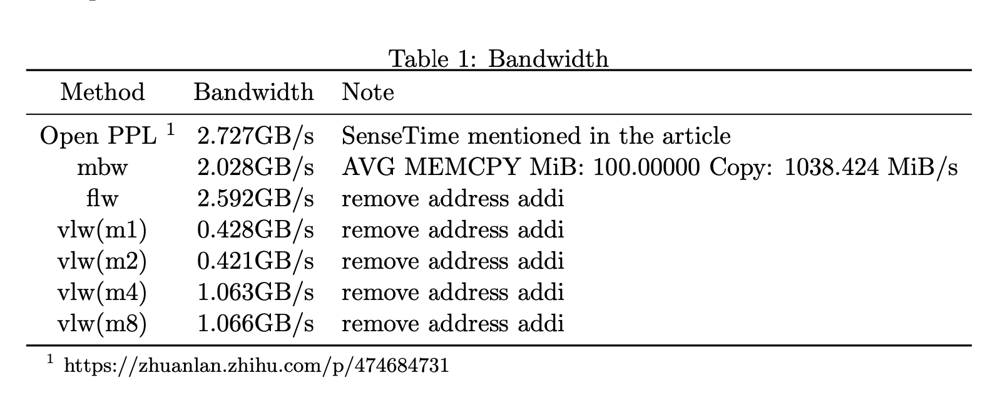

# riscv_op_test

测试与优化riscv的算子

- 运行指令

```shell
make -j8

adb push test ./.

adb shell "./test"
```

## 0.hello world
一个简易的helloworld工程，可用于测试交叉编译链是否可用。
```shell
$ make
$ adb push hello_world ./.
$ adb shell "./hello_world"
Hello NeZha
```
## 1.memory copy
memcpy的小实验，需要注意`vsetvli`、`load`、`store`的指令v0.7和v1.0是不一样的，目前用的是v0.7。
```shell
$ make
$ adb push test ./.
$ adb shell "./test"
Hello NeZha
0       1       2       3       4       5       6       7       8       9
```
| 指令    | v0.7                   | v1.0                           | 备注          |
| ------- | ---------------------- | ------------------------------ | ------------- |
| vsetvli | vsetvli t0, a2, e8, m8 | vsetvli t0, a2, e8, m8, ta, ma | Vectors of 8b |
| load    | vlb.v v0, (a1)         | vle8.v v0, (a1)                | Load bytes    |
| store   | vsb.v v0, (a3)         | vse8.v v0, (a3)                | Store bytes   |

    ta   # Tail agnostic
    tu   # Tail undisturbed
    ma   # Mask agnostic
    mu   # Mask undisturbed

> 在 v0.9 之前，当未在 vsetvli 上指定这些标志时，它们默认为掩码未受干扰/尾部未受干扰

`vsetvli t0, a2, e8`

这个例子中，初见`vsetvli`指令，a2是长度n。

- 1st，a2 = 10 --> t0 = 8 --> a2 = 2
- 2nd, a2 = 2 --> t0 = 2 --> a2 = 0 -->ret

## 2.memcpy bandwidth test
测试内存带宽的小脚本
```shell
$ make
$ adb push mbw ./.
$ adb shell "./mbw 100"
Long uses 8 bytes. Allocating 2*13107200 elements = 209715200 bytes of memory.
Using 262144 bytes as blocks for memcpy block copy test.
Getting down to business... Doing 10 runs per test.
...
AVG     Method: MEMCPY  Elapsed: 0.09614        MiB: 100.00000  Copy: 1040.166 MiB/s
...
AVG     Method: DUMB    Elapsed: 0.60301        MiB: 100.00000  Copy: 165.835 MiB/s
...
AVG     Method: MCBLOCK Elapsed: 0.09692        MiB: 100.00000  Copy: 1031.754 MiB/s
```
## 3.flw bandwidth test
使用`flw`测试内存带宽的小脚本

```shell
$ make
$ adb push test ./.
$ adb shell "./test"
time_use is 2686.789ms
```
flw: 4000MB/(2678.298 − 1171.154)ms = 2.592GB/s

## 4.vlw bandwidth test
使用`vlw`测试内存带宽的小脚本

```shell
$ make
$ adb push test ./.
$ adb shell "./test"
```
vlw(m1): 4000MB/(10391.898 − 1273.346)ms = 0.428GB/s 

vlw(m2): 4000MB/(9922.699 − 641.811)ms = 0.421GB/s 

vlw(m4): 4000MB/(4002.607 − 327.388)ms = 1.063GB/s 

vlw(m8): 4000MB/(3829.181 − 166.246)ms = 1.066GB/s

综上,哪吒D1的内存带宽测试结果为：



---

## 5.saxpy
> SAXPY（Scalar Alpha X Plus Y）是一个在 Basic Linear Algebra Subprograms（BLAS）数据包中的函数，并且是一个并行向量处理机（vector processor）中常用的计算操作指令。

y=αx+y,其中α是标量，x和y矢量。
```shell
$ make
$ adb push hello_world ./.
$ adb shell "./test"
3.100000        5.200000        7.300000        9.400000        11.500000       13.600000       15.700000       17.799999       19.900000       21.950001 23.969999
```
`vsetvli a4, a0, e32, m8 `

这个例子中，又见`vsetvli`指令，`vsetvli`使用`m8`参数设置了每条指令处理8个连续的向量寄存器，a0是长度n。

n = 11 --> a0 = 11

a = 2.0 --> fa0 = 2.0

> `vsetvli a4, a0, e32, m8`

a4 = min(11,8) = 8

> `vlw.v v0, (a1) `

v0-v7 = x0-x7  next: v0-v7 = x8-...

> `sub a0, a0, a4`

a0 = a0 - a4 = 11 - 8 = 3

> `slli a4, a4, 2 `

a4 = a4 << 2 = 8*4 = 32 # float占4个Byte

> `add a1, a1, a4 `

a1本指向x0，现在指向x8

> `vlw.v v8, (a2) `

y0-y7 load到 v8-v15

> `vfmacc.vf v8, fa0, v0 `

(v8-v15) = fa0 * (v0-v7) + (v8-v15)

> `vsw.v v8, (a2) `

store到`y0`

> `add a2, a2, a4 `

`a1`本指向`y0`，现在指向`y8`

---

OK，我认为进行到这里，一些关于`RISC-V V扩展`的基础知识已经具备，关于板子的内存性能也已经得到，可以开始写 `sgemm` 算子了!